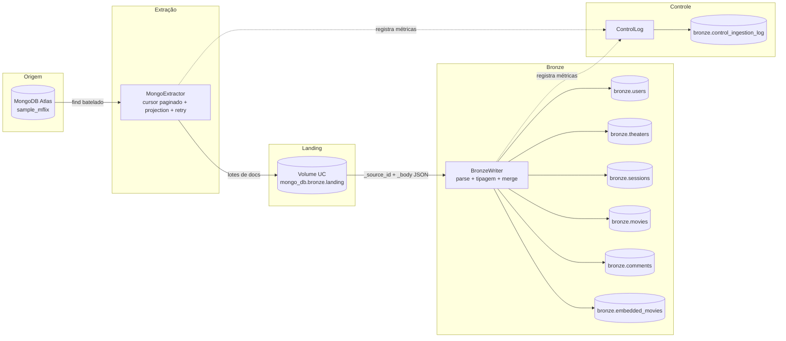
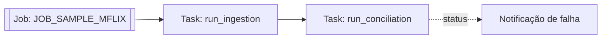

# Arquitetura da Solução — Ingestão sample_mflix

## Visão geral

Pipeline de ingestão que extrai as 6 coleções do `sample_mflix` (MongoDB
Atlas) e materializa em uma camada Bronze (Delta Lake / Unity Catalog), com
landing intermediária, rastreabilidade completa e controle de execuções.

## Diagrama

## Orquestração (Databricks Job)

- Job criado via UI do Databricks, com 2 tasks encadeadas por `depends_on`.
- `run_ingestion` roda primeiro; `run_conciliation` (reconciliação) só executa
  se a primeira terminar com sucesso.
- Retry automático: até 2 tentativas por task, com 10 min de intervalo.
- Agendamento diário via cron (`57 0 9 * * ?`, UTC), mantido **pausado** fora
  de janelas de demonstração para não consumir o cluster gratuito do Atlas
  sem necessidade.

## Componentes

| Componente | Arquivo | Responsabilidade |
|---|---|---|
| `MongoExtractor` | `src/extractor.py` | Conecta ao Atlas, extrai por lotes com projection, filtro de watermark e retry/backoff |
| `LandingWriter` | `src/landing_writer.py` | Grava cada lote como JSON Lines na landing (`_source_id`, `_body`) |
| `BronzeWriter` | `src/bronze_writer.py` | Lê da landing, faz parse do `_body`, tipa os campos e grava/mescla na Bronze |
| `ControlLog` | `src/control_log.py` | Lê o último watermark e registra cada execução na tabela de controle |
| `run_ingestion.py` | `notebooks/` | Orquestra o loop: extrai → landing → Bronze → reconciliação → log |
| `run_reconciliation.py` | `notebooks/` | Validações de qualidade pós-carga (nulos, duplicidade) |
| `validation.py` | `notebooks/` | Checklist automatizado de entrega, valida R1–R8 |

## Fluxo de dados

1. **Extração**: `MongoExtractor` lê a coleção em lotes (`batch_size`
   configurável), aplicando projection (só os campos necessários em
   `config.yaml`) e filtro de watermark quando o modo é incremental.
2. **Landing**: cada lote é serializado como JSON Lines e gravado em
   `/Volumes/mongo_db/bronze/landing/<collection>/_ingestion_date=YYYY-MM-DD/`,
   com duas colunas fixas — `_source_id` e `_body` (documento inteiro
   serializado). Esse formato fixo evita qualquer erro de inferência de
   schema do Spark sobre dados schema-less do MongoDB.
3. **Bronze**: o `_body` é relido como JSON estruturado
   (`primitivesAsString=true` para tolerar tipos divergentes entre
   documentos, `mergeSchema=true` para tolerar campo novo entre execuções).
   O resultado é gravado como **tabela gerenciada** no Unity Catalog
   (`mongo_db.bronze.<collection>`), particionada por `_ingestion_date`.
4. **Idempotência**: a escrita usa `MERGE` com chave composta
   `(_source_id, _ingestion_date)` — rodar a mesma carga duas vezes no mesmo
   dia não duplica; uma execução em outro dia gera uma nova partição
   histórica (comportamento esperado de uma Bronze append-only).
5. **Controle**: cada execução (por coleção) grava uma linha em
   `bronze.control_ingestion_log` com watermark inicial/final, contagens de
   origem e destino, duração e status (`SUCCESS`/`PARTIAL`/`FAILED`).
6. **Reconciliação**: ao final de cada execução, o pipeline compara
   `qtd_lida_origem` × `qtd_gravada_destino`; divergência acima do limiar
   (`reconciliation_threshold_pct`, definido em `config.yaml`) marca a
   execução como `PARTIAL`.

## Decisões técnicas

- **Landing como buffer intermediário, não a Bronze final**: separa o
  problema de "ler algo schema-less do Mongo sem quebrar" (landing, schema
  fixo `_source_id`/`_body`) do problema de "estruturar isso em colunas
  tipadas" (Bronze). Evita `CANNOT_DETERMINE_TYPE` na origem.
- **`primitivesAsString` na Bronze**: campos primitivos (número, texto,
  boolean) são gravados como string. Isso tolera o schema-less do MongoDB
  (ex.: `imdb.rating` ora numérico, ora `"N/A"`) sem falhar a ingestão. A
  tipagem final (float, date, etc.) fica a cargo da camada Silver.
- **`mergeSchema=true`**: permite que a Bronze evolua automaticamente quando
  um documento traz um campo novo em execuções futuras, sem quebrar o
  pipeline nem exigir alteração manual de schema.
- **`_rescued_data`**: coluna de quarentena — nenhum registro é descartado
  silenciosamente; o que não encaixa na estrutura esperada é preservado
  aqui.
- **Tabelas gerenciadas (sem path físico explícito)**: a Bronze usa
  `saveAsTable`/`DeltaTable.forName` sem `.option("path", ...)`, deixando o
  Unity Catalog gerenciar o armazenamento. Evita conflitos de
  permissão/Volume que ocorrem ao apontar path manualmente em ambiente
  Serverless.
- **Compatibilidade com Serverless**: o pipeline evita APIs de RDD
  (`.rdd.map`) e `.cache()`/`.persist()`, não suportadas em Spark
  Connect/Serverless — toda transformação usa DataFrame puro.
- **Configuração externalizada**: `config/config.yaml` define, por coleção,
  `modo_carga`, `campo_watermark`, `chave`, `campos` (projection) e
  `batch_size` — nenhum valor de negócio fica hardcoded no código.
- **Secrets fora do repositório**: a connection string do Atlas é gravada
  via `dbutils.secrets` (`notebooks/create_secret.py`), nunca versionada em
  texto puro.

## Limitações conhecidas

- A tipagem final dos campos (numérico, data) não ocorre na Bronze — é
  responsabilidade da camada Silver.
- O limiar de reconciliação é global (`reconciliation_threshold_pct`), não
  por coleção.
- A landing não é limpa automaticamente; arquivos antigos se acumulam no
  Volume (pode ser tratado com uma rotina de retenção, fora do escopo
  atual).
- O Job de orquestração foi criado via UI do Databricks; o `notebook_path`
  de cada task aponta para o workspace pessoal do responsável pelo deploy.
  Para reproduzir em outro ambiente, é necessário importar os notebooks e
  ajustar o caminho nas tasks.
